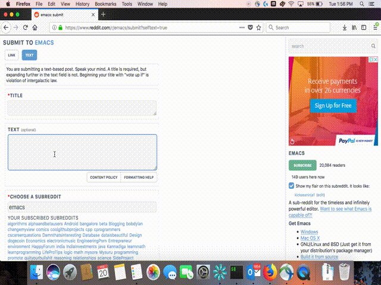
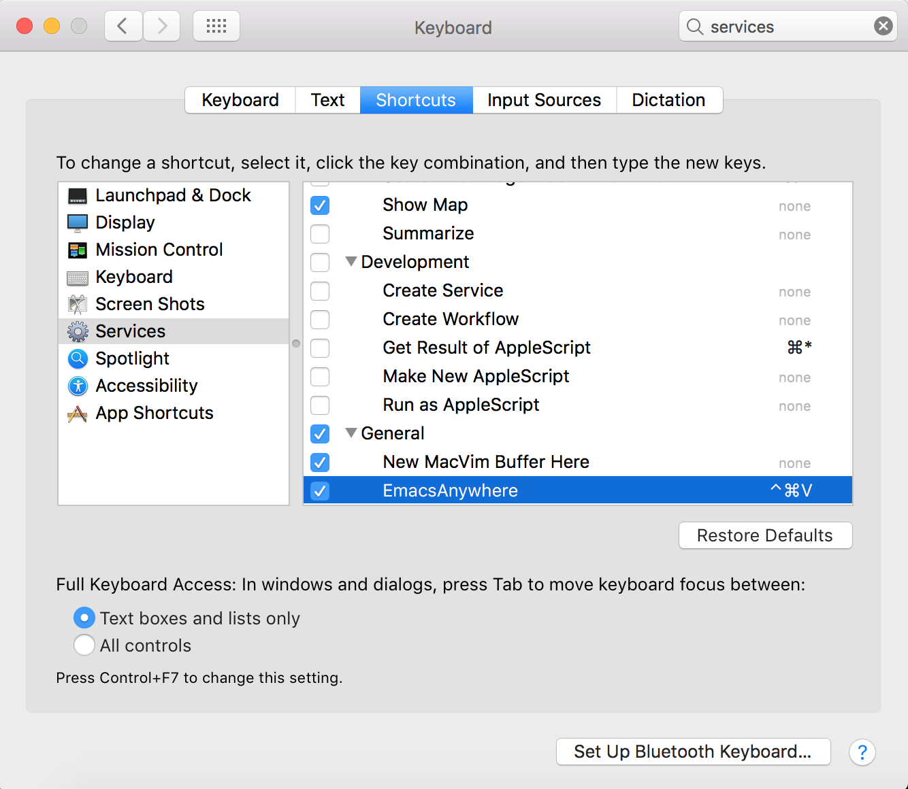

# emacs-anywhere

Sometimes, you edit text outside of Emacs. These are sad times. Enter
emacs-anywhere!



Once [invoked](#keybinding), emacs-anywhere will open a buffer. Close it and its
contents are copied to your __clipboard__ and your previous application is
refocused.

## Installation

#### Requirements

__OSX:__

- MacEmacs (`brew install macvim`)

__Linux:__

- Gnome (or a derivative)
- gEmacs

#### Install

```bash
curl -fsSL https://raw.github.com/prathik/emacs-anywhere/master/install | bash
```

__OSX caveat:__ key binding is unbound by default. See [keybinding](#keybinding)
for details.

#### Update

```bash
~/.emacs-anywhere/update
```

#### Uninstall

```bash
~/.emacs-anywhere/uninstall
```

## Keybinding

__OSX:__ ( default = unbound, suggested = `ctrl+cmd+v` )

The keyboard shortcut for invoking emacs-anywhere is unbound by default on OSX.
The installation script will automatically open
`System Preferences > Keyboard > Shortcuts`. Fill in the following:



__Linux:__ ( default = `ctrl+alt+v` )

*Gnome*
```bash
$ gconftool -t str --set /desktop/gnome/keybindings/emacs-anywhere/binding <custom binding>
```

*I3WM*

```bash
$ echo "bindsym $mod+Alt+v exec ~/.emacs-anywhere/bin/run" >> ~/.i3/config # remember to reload your config after
```
Adjust in case `$mod` is not set to ctrl.

## History

emacs-anywhere creates a temporary file in `/tmp/emacs-anywhere` when
invoked. These files stick around until you restart your system, giving you
a temporary history.

View your history:

```bash
$ ls /tmp/emacs-anywhere
```

Reopen your most recent file:

```bash
$ vim $( ls /tmp/emacs-anywhere | sort -r | head -n 1 )
```

## Why?

I use Emacs for _almost_ everything. I wish I didn't have to say _almost_. My
usual workflow is to open Emacs, write, copy the text out of my current buffer
and paste it into whatever application I was just using. emacs-anywhere attempts
to automate this process as much as possible, reducing the friction of using
Emacs to do more than just edit code.

## Contributing

Love emacs-anywhere? Hate it? Want to change it completely? Email me or open an
issue and lets talk. Pull requests, suggestions and issues of any kind are
welcome with open arms.

## License

MIT.
